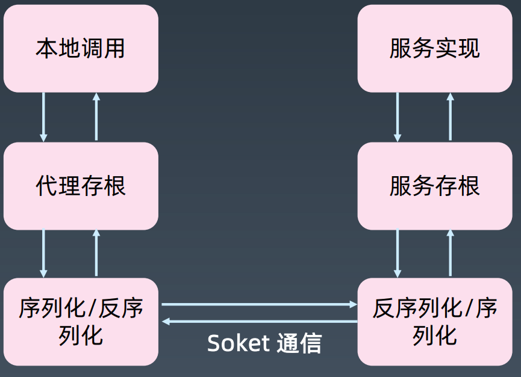

# 从零实现RPC


## rpc的调用跟http区别
1. RPC可以使用多种底层协议,如TCP、UDP等,而HTTP则只能通过TCP协
2. RPC可以使用自定义的二进制协议,而HTTP使用文本协议
3. RPC直接调用服务端提供的方法,类似于本地方法调用
4. HTTP通过URI确定资源位置,RPC通过存根确定资源位置

# RPC 传输流程


## 名词解释

### 存根
1. 代理存根(Client Stub)：存放服务端地址信息，将客户端的请求参数数据信息打包成网络消息，再通过网络传输发送给服务端。
2. 服务存根(Server Stub)：接收客户端发送过来的请求消息并进行解包，然后再调用本地服务进行处理。

### 序列化/反序列化
编解码通信时的数据

### Socket 通信
数据交换的协议


## 实现过程

### 1. 服务端（服务的真正提供者）准备服务
1. 实现方法 `UserServiceImpl implements UserService` 形成当前服务具有的能力
2. 对准备的能力进行标注`@TProvider`表示其为服务提供者可以对外提供服务
3. 利用`ProvidersBootstrap` 启动时扫描全局将所有提供者的信息`全限定名,对象实例` 存起来备用`Map#skeleton()`
4. 构建序列化和反序列化的结构对象 `RpcRequest` `RpcResponse`
5. 暴露调用方式，一个HTTP接口 `TrpcDemoProviderApplication#invoke()` 

### 2. 客户端(服务调用方) 调用服务端提供的能力
1. 从‘注册中心’拿到服务端基础信息, 暴露出来的调用地址 `POST http://localhost:8080/`
2. 根据暴露出来的服务能力进行组装调用参数 `RpcRequest`
```http request
Content-Type: application/json

{
  "service": "cn.tannn.trpc.demo.api.UserService",
  "method": "findById",
  "args": [101]
}
```

### 3. 服务端（服务的真正提供者）提供服务并回馈结果
1. 解析参数 `RpcRequest`
2. 根据`service`参数去`skeleton`中寻找提供者
3. 拿到提供者的实例后根据`method` `args` 进行方法调用
4. 得到执行结果后包装成`RpcResponse` 返回给客户端

### 4. 客户端(服务调用方) 拿到结果进行业务处理 


